# Site overview image concepts

These ten review concepts and one selected hybrid candidate explore a new 1200 by 630 site overview image for link previews. They are not active production assets. The current `social-card-v7.jpg` remains unchanged until the final candidate passes small-preview review and is deliberately activated.

## Selected finalists

The owner selected two directions on 2026-08-30:

- [Stacked course pages](05-stacked-course-pages.jpg), for its open set of visible courses and class-material feel.
- [Honest product composite](10-honest-product-composite.jpg), for its direct course, lesson, code, and output view.

The production design should preserve the generous whitespace and large language markers from the stacked pages while using the honest lesson-and-practice content from the product composite. The final image must remain simpler than a full application screenshot.

## Selected hybrid production candidate

[Candidate 11](11-selected-hybrid-production-candidate.jpg) combines the two selected directions. It keeps the four stacked open-course tabs and shows one restrained lesson, code, and output area on the front C++ sheet. It is normalized to 1200 by 630 JPEG for link-preview review. It is not yet referenced by public metadata.

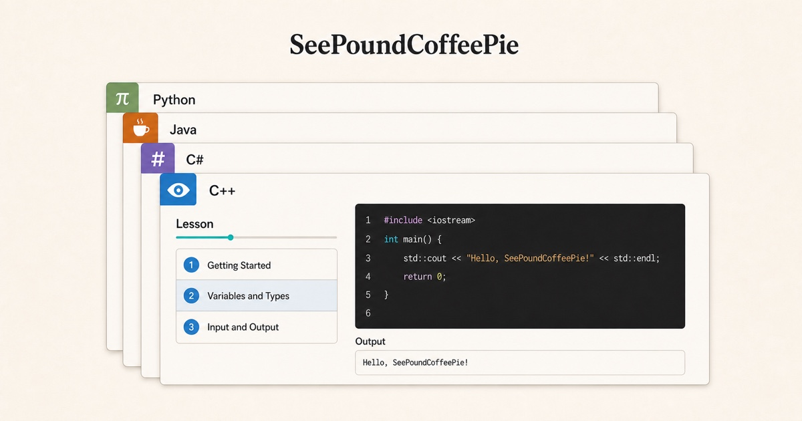

## Shared rules

- No slogan or tagline.
- No marketing copy or unexplained jargon.
- No space scene, stars, particles, glow, neon, or decorative technology.
- Use the current Workshop colors: warm paper, dark ink, restrained teal, amber, brick, violet, and blue.
- Use the current flat language symbols in this order: eye for C++, `#` for C#, coffee cup for Java, and `π` for Python.
- Show open courses, lessons, practice, or progress as the actual platform does.
- Keep the composition readable when reduced to a small link preview.

## 1. Four open course cards

Four large course cards make the available languages clear without adding interface clutter.

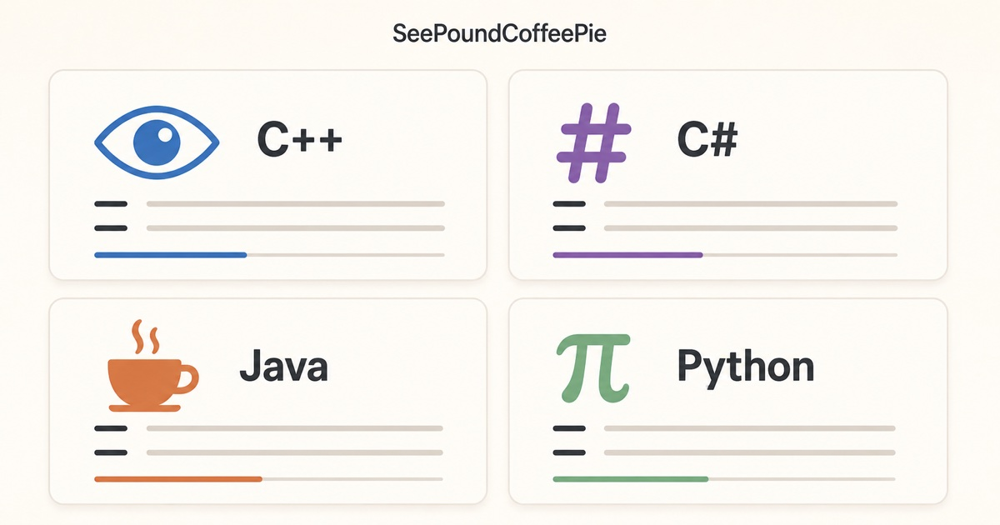

## 2. Courses and practice

A compact course list opens into a beginner lesson and code-practice area. This explains more of the product, but contains more detail at small sizes.

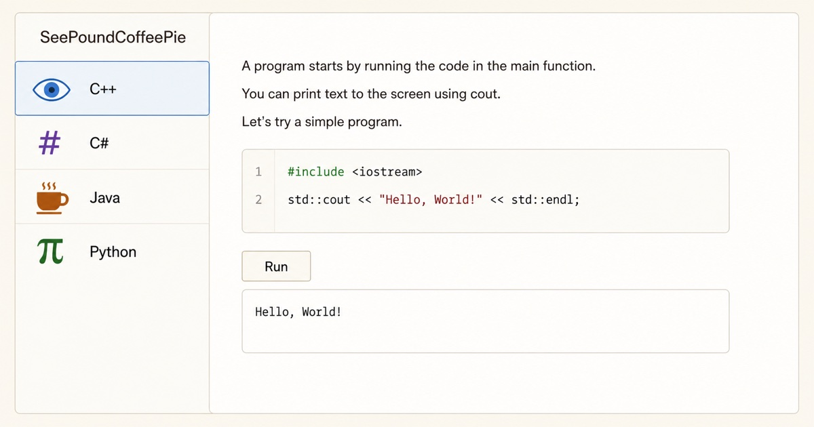

## 3. One open lesson

**Teaching-first finalist.** A simplified lesson, course outline, code editor, and output show what learning on the platform feels like.

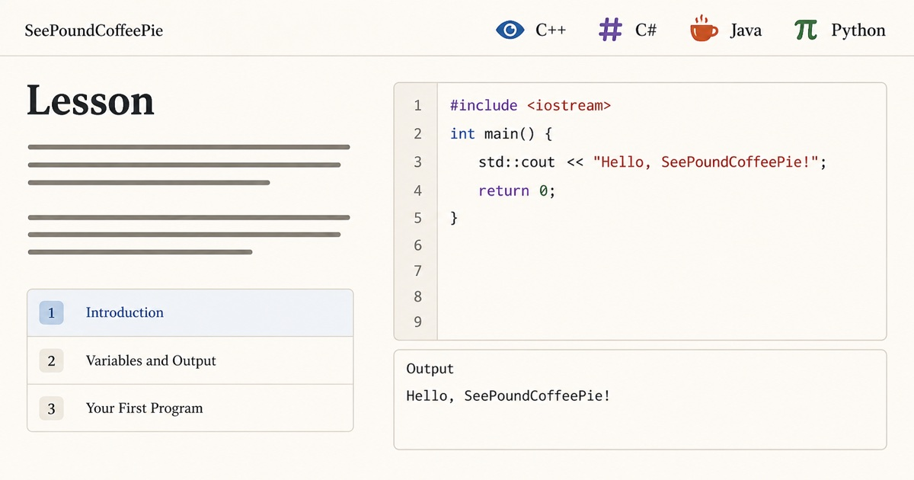

## 4. Language tabs

The four language symbols become wide course tabs above a short lesson list and practice area.

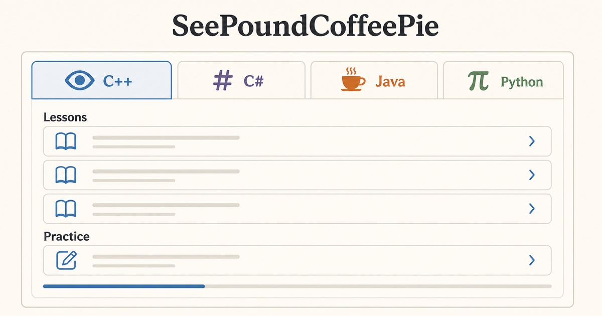

## 5. Stacked course pages

Four printed-course sheets use visible language tabs. The front sheet shows lessons and practice without looking like a dashboard.

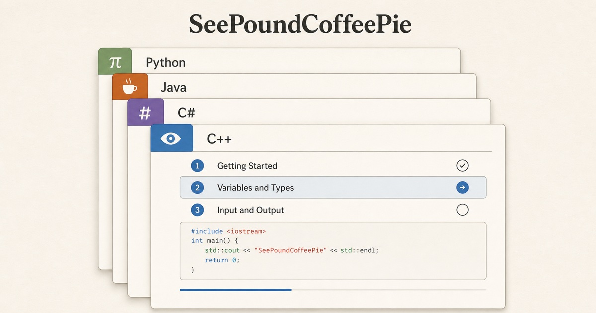

## 6. Courses, lessons, practice, progress

Four plain sections explain the main parts of the platform. This behaves more like a simple overview diagram than an advertisement.

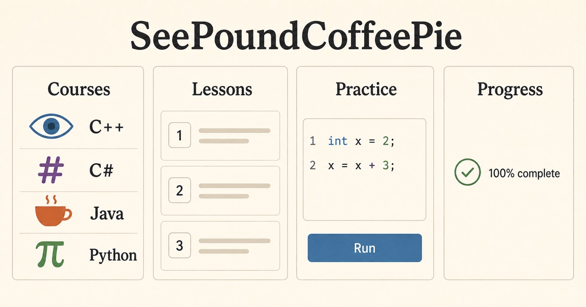

## 7. Open study book

An open-book layout presents the four courses on one page and a lesson with practice on the other. It is welcoming, though less like the real interface.

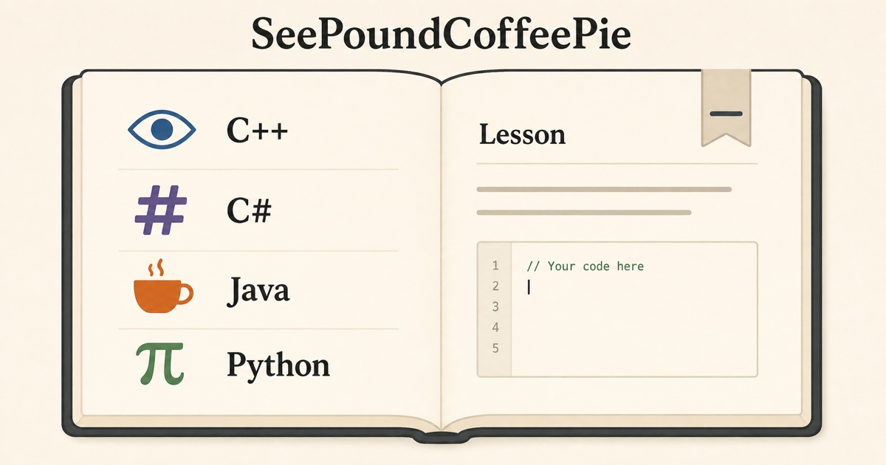

## 8. Four course columns

Each language receives its own spacious column with lesson rows and simple progress. This is a clear catalog-style alternative.

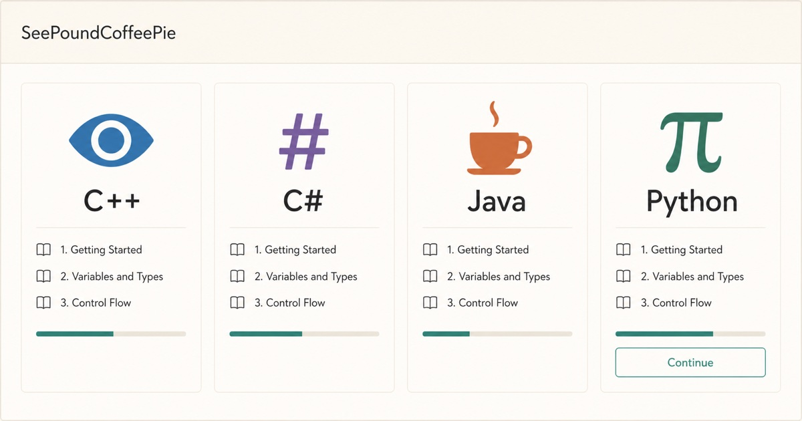

## 9. Code practice at the center

A central code editor receives the strongest emphasis, with language choices, a short lesson outline, output, and progress around it.

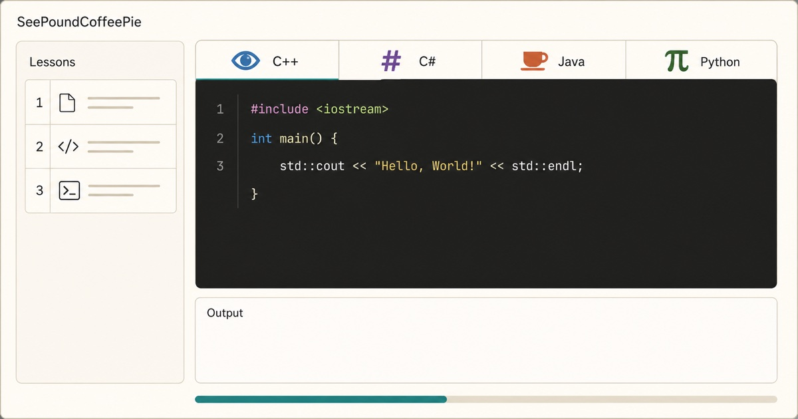

## 10. Honest product composite

**Platform-overview finalist.** A simplified course catalog sits beside a real-looking lesson and code-practice view. It most directly reflects the current product.

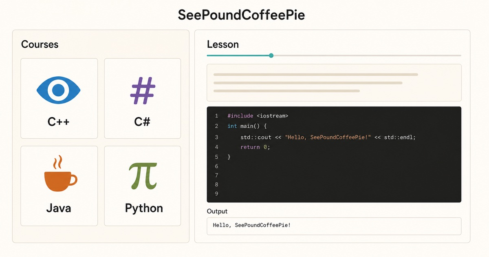

## 11. Selected stacked-course and lesson-workspace hybrid

The two approved directions are combined into one small-preview candidate with the brand name, four course symbols, a short lesson list, code, and output. It contains no slogan or decorative technology.

## Next production pass

Review candidate 11 at actual Discord, Messages, and social-card thumbnail sizes. If the text and symbols remain clear, copy it to a new versioned public filename, update the Open Graph and card metadata, verify the deployed 1200 by 630 asset and cache behavior, and retain the prior card as the rollback source. If it does not remain clear, revise this candidate without re-opening the visual direction.

## Generation record

The concepts were created with the built-in ImageGen tool after reviewing the current staging course catalog, lesson workspace, active social card, palette, and language-symbol system. The generated images were normalized to 1200 by 630 RGB JPEG files for direct link-preview comparison.

The shared prompt requested a simple editorial product illustration based on the current Open Learning Workshop interface, with warm paper surfaces, dark ink, restrained course colors, generous whitespace, readable type, flat language symbols, and no slogan, jargon, space imagery, glow, gradients, badges, XP, fake analytics, mascots, or decorative particles.

Each prompt then requested one distinct composition:

1. A two-by-two grid of open course cards.
2. A course list beside one lesson and practice area.
3. One open lesson with outline, editor, and output.
4. Four language tabs above lessons and practice.
5. Four slightly offset printed course sheets.
6. Four labeled sections for courses, lessons, practice, and progress.
7. A flat open-study-book composition.
8. Four evenly spaced course columns.
9. A central code editor with supporting lesson context.
10. A simplified catalog and lesson-workspace composite based on the current platform.

Candidate 11 was generated with concepts 5 and 10 as references. The prompt requested a polished, extra-wide UI illustration that preserves the four exact language symbols, one open C++ lesson, code, and output; keeps all required content inside the link-preview safe area; and excludes slogans, marketing copy, locks, rewards, fake statistics, space imagery, glow, gradients, mascots, and decorative technology. The selected output was mechanically normalized to a 1200 by 630 RGB JPEG without changing its content.
